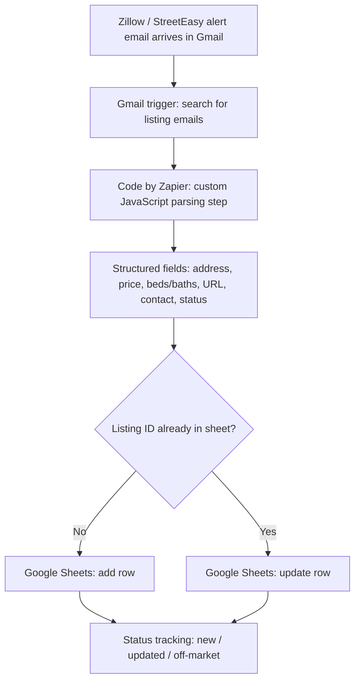

# Real Estate Lead Tracking & Listing Alert Automation

A no-code pipeline (with a custom JavaScript step) that watches Gmail for property listing emails, parses them into structured data, and keeps a Google Sheet current — new listings added, existing ones updated in place.

## The Problem

Monitoring Zillow and StreetEasy listings manually means refreshing pages, missing new listings, and losing track of leads. Hours of repetitive work with zero leverage.

## The Constraint

Neither Zillow nor StreetEasy offers a public API or a native Zapier trigger for listings. So the pipeline starts with what exists: email.

## Architecture

## Pipeline Stages

### 1. Trigger — Gmail Search
A Gmail trigger watches for incoming Zillow/StreetEasy alert emails via search query. Every matching email fires the workflow — no polling a dashboard, no manual checks.

### 2. Parsing — Custom JavaScript (Code by Zapier)
Listing emails are HTML and inconsistent. A custom JavaScript step extracts the fields from the email body and normalizes them into clean, structured output. This is the most technical part of the build: the script handles messy real-world email formatting so downstream steps always receive predictable data.

### 3. Logging — Google Sheets (Add Row + Update Row)
Parsed data lands in a Google Sheet. New listings are added as rows; existing listings (matched on listing ID) are updated in place — so the sheet stays current instead of filling with duplicates. Status is tracked as `new`, `updated`, or `off_market`.

| Parsed field | Sheet column | Notes |
|---|---|---|
| Property address | `address` | Normalized to single-line format |
| Neighborhood | `neighborhood` | As reported by source |
| Price | `price` | Numeric; rent vs. sale flagged in `listing_type` |
| Bedrooms / Bathrooms | `beds`, `baths` | Integer coercion |
| Listing URL | `listing_url` | Direct link to source listing |
| Inquirer name / email / phone | `contact_name`, `contact_email`, `contact_phone` | Stored as mock data in this repo (see Privacy note) |
| Listing status | `status` | `new`, `updated`, or `off_market` |

### 4. Dedup Logic
Before writing, the workflow checks whether the listing ID already exists in the sheet. Match → update the existing row. No match → add a new row. One row per listing, always current.

## Sample Payload

See `sample-payloads/listing-alert.json` for an anonymized example of the structured data the JavaScript step produces.

## Runbook

See `docs/runbook.md` for deployment, maintenance, and troubleshooting notes.

## Privacy Note

This repository contains **mock data only**. No real names, emails, phone numbers, or listing details are included. The sample payload uses clearly synthetic values.

## Skills Demonstrated

- No-code systems architecture (Zapier)
- Gmail as an event trigger / ingestion layer
- Custom JavaScript for data parsing and normalization (Code by Zapier)
- Google Sheets as a lightweight operational database (upsert logic)
- Deduplication and state tracking
- Technical documentation and runbook authoring
